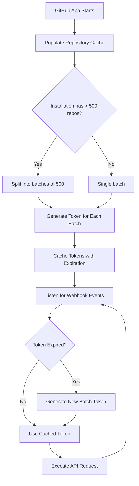
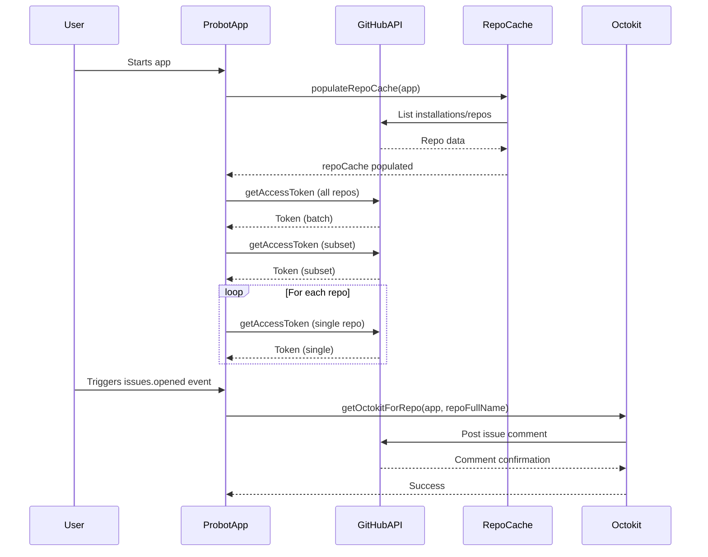

# split-token-app

> A GitHub App built with [Probot](https://github.com/probot/probot).
 By default, when you generate an installation access token for a GitHub App, the installation access token will have access to all repositories that the installation was granted access to. 
 If you chose to install the App on selected Repositories, you are limited to 500 repositories per requested App-Token. You can use the repositories or repository_ids to specify individual repositories that the AppInstallationToken can access.

This App is a quick demonstration on how the token generation bevaves and an example of a batch token creation.

---
NOTE: This App is best tested in an ORG with more than 500 Repositories!

### High-Level Process Flow

### Summary of requirements:

1. You need a list of all repos registered with the app, either their repo_id or repo_name (short name) and installation_id.
1. For each installation, if there are more than 500 repos, split them into batches of 500.
1. For each batch, create a batch token (installation access token) associated it with all repos in that batch.
1. Cache batch tokens and associate them with their batch of repos.
1. When a token is requested for a repo, return the cached token, if it is still valid (not expired).
1. If the token is expired (older than 60 minutes), create a new token for the batch, update the cache, and use it for subsequent calls.

### Implementation notes:

- You need a cache structure that maps batch (or repo ID) to its current token and the token’s expiration time.
- On each API call, check the cache for the batch token:
  - If the token is present and not expired, use it.
  - If not, request a new token, cache it with its expiration, and use it.
- This logic can be wrapped in a helper or middleware so developers don’t need to manage tokens manually.

### Utility module: `tokenBatcher`

#### Sample

TBD

---

---

## Contributing

If you have suggestions for how split-token-app could be improved, or want to report a bug, open an issue! We'd love all and any contributions.

For more, check out the [Contributing Guide](CONTRIBUTING.md).

## License

[ISC](LICENSE) © 2025 Jürgen Efeish

---
