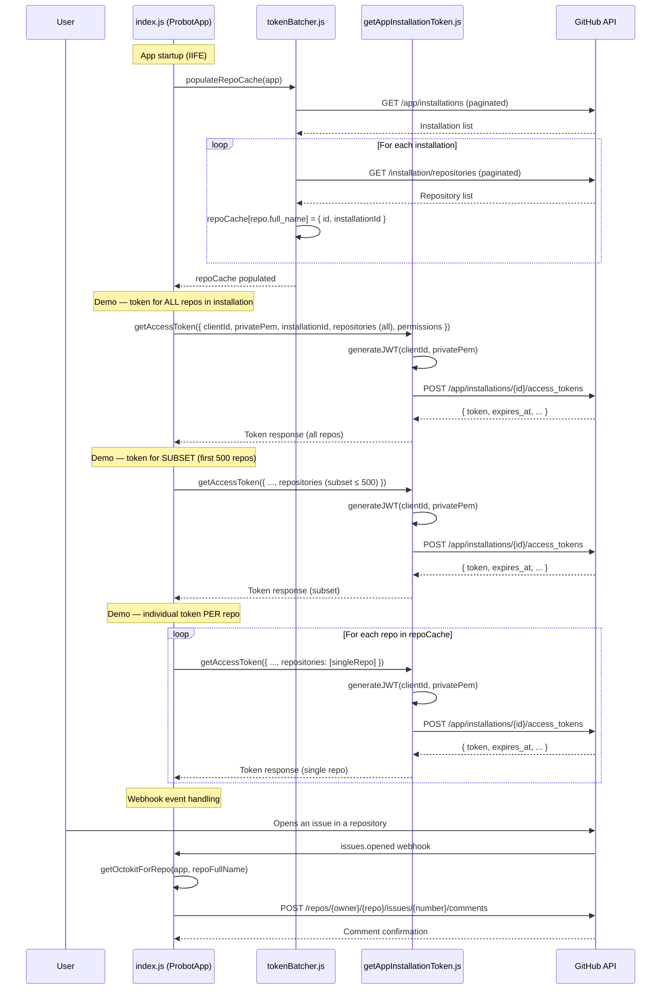

# Technical Documentation: split-token-app

## Overview

`split-token-app` is a [Probot](https://github.com/probot/probot)-based GitHub App that demonstrates how to manage GitHub App installation access tokens for organizations with more than 500 repositories.

By default, a GitHub App installation access token grants access to all repositories the installation was granted access to, up to a maximum of 500 repositories per token. This app shows how to split repositories into batches of 500 and cache tokens per batch.

---

## Architecture

The application is composed of three core modules:

| Module | File | Responsibility |
|---|---|---|
| App Entry Point | `index.js` | Probot app lifecycle, startup caching, token demos, webhook handling |
| Token Batcher | `tokenBatcher.js` | Repository cache management, batch splitting, scoped token requests |
| Token Generator | `getAppInstallationToken.js` | JWT generation, GitHub API calls, retry logic |

---

## Module Descriptions

### `index.js` — App Entry Point

The main Probot application module. It exports a single default function that Probot invokes on startup.

**Startup sequence (IIFE):**

1. Calls `populateRepoCache(app)` to build an in-memory map of all repositories across all installations.
2. Reads `APP_ID` and `PRIVATE_KEY` from environment variables.
3. Demonstrates three token generation strategies:
   - **All repos token**: A single token scoped to every repository in one installation.
   - **Subset token**: A token scoped to the first 500 repos of the installation.
   - **Individual repo tokens**: One token per repository (loop over all repos in the cache).

**Webhook handler:**

| Event | Handler | Action |
|---|---|---|
| `issues.opened` | `app.on("issues.opened", ...)` | Retrieves an authenticated Octokit instance for the event's repository, then posts a comment to the new issue. |

---

### `tokenBatcher.js` — Token Batcher Utility

Provides all the logic for splitting repository lists into batches and requesting scoped installation access tokens.

#### Exported Values

| Export | Type | Description |
|---|---|---|
| `repoCache` | `object` | Shared in-memory cache. Keys are repository full names (`owner/repo`), values are `{ id, installationId }`. |

#### Exported Functions

---

##### `populateRepoCache(app)`

Clears and rebuilds `repoCache` by querying all installations and their repositories from the GitHub API.

| Parameter | Type | Description |
|---|---|---|
| `app` | `ProbotApp` | The authenticated Probot app instance |

**Returns:** `Promise<object>` — the populated `repoCache` map.

**Behaviour:**
- Paginates over `GET /app/installations`
- For each installation, paginates over `GET /installation/repositories`
- Stores each repo as `repoCache[repo.full_name] = { id, installationId }`

---

##### `chunk(items, size?)`

Splits an array into equally sized sub-arrays (the last chunk may be smaller).

| Parameter | Type | Default | Description |
|---|---|---|---|
| `items` | `string[]` | — | Array to chunk |
| `size` | `number` | `500` | Maximum chunk size |

**Returns:** `string[][]` — array of chunks, or `[]` if `items` is not an array.

---

##### `listReposForInstallation(repoCache, installationId)`

Derives a stable, sorted list of repository short names (no owner prefix) for a given installation.

| Parameter | Type | Description |
|---|---|---|
| `repoCache` | `object` | The populated `repoCache` map |
| `installationId` | `number\|string` | The GitHub App installation ID |

**Returns:** `string[]` — sorted repository names for that installation.

---

##### `reposForBatch(sortedRepos, batchIndex?, batchSize?)`

Extracts the repository slice corresponding to a given batch index.

| Parameter | Type | Default | Description |
|---|---|---|---|
| `sortedRepos` | `string[]` | — | Sorted canonical repo name list |
| `batchIndex` | `number` | `0` | Zero-based batch index |
| `batchSize` | `number` | `500` | Number of repos per batch |

**Returns:** `string[]` — the subset of repos for that batch (empty if out of range).  
**Throws:** `Error` if `batchIndex < 0`.

---

##### `getBatchToken({ clientId, privatePem, installationId, repositories, permissions? })`

Requests an installation access token scoped to a single batch of up to 500 repositories.

| Parameter | Type | Description |
|---|---|---|
| `clientId` | `string\|number` | GitHub App Client ID |
| `privatePem` | `string` | PEM-encoded private key or path to PEM file |
| `installationId` | `string\|number` | Installation ID |
| `repositories` | `string[]` | Repository short names (max 500) |
| `permissions` | `object` | Optional permissions map (e.g. `{ contents: 'read' }`) |

**Returns:** `Promise<object>` — GitHub token response (`token`, `expires_at`, `permissions`, `repositories`).  
**Throws:** `Error` if `repositories` is empty or contains more than 500 entries.

---

##### `getAllBatchTokens({ clientId, privatePem, installationId, sortedRepos, permissions? })`

Convenience wrapper that requests tokens for **every** batch in sequence. Use with care — each call consumes a rate-limited API request.

| Parameter | Type | Description |
|---|---|---|
| `clientId` | `string\|number` | GitHub App Client ID |
| `privatePem` | `string` | PEM-encoded private key or path to PEM file |
| `installationId` | `string\|number` | Installation ID |
| `sortedRepos` | `string[]` | Full sorted canonical repo list |
| `permissions` | `object` | Optional permissions map |

**Returns:** `Promise<object[]>` — array of token responses, each augmented with `batchIndex` and `size`.

---

### `getAppInstallationToken.js` — Token Generator

Handles low-level GitHub App authentication: JWT generation and installation access token retrieval with automatic retry on transient failures.

#### Exported Functions

---

##### `getAccessToken({ clientId, privatePem, installationId, repositories?, permissions? })`

Core public function. Generates a JWT and exchanges it for a GitHub installation access token.

| Parameter | Type | Description |
|---|---|---|
| `clientId` | `string` | GitHub App Client ID (`APP_ID`) |
| `privatePem` | `string` | PEM private key string or path to PEM file |
| `installationId` | `string\|number` | GitHub App installation ID |
| `repositories` | `string[]` | Optional: restrict token to these repos |
| `permissions` | `object` | Optional: restrict token to these permissions |

**Returns:** `Promise<object>` — GitHub API response with `token`, `expires_at`, `permissions`, and `repositories`.

---

#### Internal Functions

| Function | Description |
|---|---|
| `generateJWT(clientId, privatePem)` | Creates a 9-minute RS256-signed JWT for app-level authentication. Reads the PEM from a file if a path is provided. |
| `requestInstallationAccessToken({ jwtToken, installationId, data })` | POSTs to `POST /app/installations/{installationId}/access_tokens`. Retries up to `TOKEN_REQUEST_RETRY_ATTEMPTS` (default: 3) times with exponential back-off on HTTP 502/503/504 or network errors. |
| `validateCoreParams({ clientId, privatePem, installationId })` | Throws if any required credential is missing. |
| `buildAccessTokenRequestBody(repositories, permissions)` | Assembles the optional request body (`repositories`, `permissions`). Returns `undefined` if both inputs are falsy. |

#### Environment Variables

| Variable | Default | Description |
|---|---|---|
| `APP_ID` | — | GitHub App Client ID |
| `PRIVATE_KEY` | — | PEM private key content or file path |
| `TOKEN_REQUEST_RETRY_ATTEMPTS` | `3` | Number of retry attempts for transient API errors |
| `TOKEN_REQUEST_RETRY_BASE_MS` | `300` | Base delay in milliseconds for exponential back-off |

---

## Process Flow

The sequence diagram below illustrates the full lifecycle: from app startup and repository cache population, through batch token generation, to handling a live webhook event.



---

## Token Batching Strategy

When an installation has more than 500 repositories, a single access token cannot cover all of them. The recommended approach using the utilities in `tokenBatcher.js`:

```
All repos for installation
        │
        ▼
listReposForInstallation()   ← stable sorted list
        │
        ▼
chunk(repos, 500)            ← splits into batches of ≤ 500
        │
   ┌────┴────┐
batch 0   batch 1  ...  batch N
   │         │               │
   ▼         ▼               ▼
getBatchToken()  (one API call per batch)
```

Tokens expire after **60 minutes**. The `expires_at` field in each token response should be used to decide when to call `getBatchToken()` again for a given batch.

---

## Data Structures

### `repoCache`

```js
{
  "owner/repo-name": {
    id: 123456789,          // GitHub repository ID
    installationId: 987654  // GitHub App installation ID
  },
  // ...
}
```

### Token Response (from GitHub API)

```js
{
  token: "ghs_...",               // Installation access token
  expires_at: "2025-01-01T01:00:00Z", // ISO 8601 expiry (60 minutes from creation)
  permissions: {
    contents: "read",
    issues: "write"
    // ...
  },
  repositories: [
    { id: 123, full_name: "owner/repo", ... },
    // ...
  ]
}
```
